---
tags:
   - groups
---
# Scattered Spider
## ID:G1015
[Scattered Spider](/mitre/groups/G1015) is a native English-speaking cybercriminal group that has been active since at least 2022.(Citation: CrowdStrike Scattered Spider Profile)(Citation: MSTIC Octo Tempest Operations October 2023) The group initially targeted customer relationship management and business-process outsourcing (BPO) firms as well as telecommunications and technology companies. Beginning in 2023, [Scattered Spider](/mitre/groups/G1015) expanded its operations to compromise victims in the gaming, hospitality, retail, MSP, manufacturing, and financial sectors.(Citation: MSTIC Octo Tempest Operations October 2023) During campaigns, [Scattered Spider](/mitre/groups/G1015) has leveraged targeted social-engineering techniques, attempted to bypass popular endpoint security tools, and more recently, deployed ransomware for financial gain.(Citation: CISA Scattered Spider Advisory November 2023)(Citation: CrowdStrike Scattered Spider BYOVD January 2023)(Citation: CrowdStrike Scattered Spider Profile)(Citation: MSTIC Octo Tempest Operations October 2023)(Citation: Crowdstrike TELCO BPO Campaign December 2022)
## Techniques Used By Group
* [Phishing for Information](techniques/T1598)
* [Code Signing](techniques/T1553/002)
* [Conditional Access Policies](techniques/T1556/009)
* [Cloud Infrastructure Discovery](techniques/T1580)
* [NTDS](techniques/T1003/003)
* [Domain Account](techniques/T1087/002)
* [Trust Modification](techniques/T1484/002)
* [Email Hiding Rules](techniques/T1564/008)
* [Steal Web Session Cookie](techniques/T1539)
* [Private Keys](techniques/T1552/004)
* [Cloud Service Dashboard](techniques/T1538)
* [Data Encrypted for Impact](techniques/T1486)
* [External Remote Services](techniques/T1133)
* [User Execution](techniques/T1204)
* [Multi-Factor Authentication](techniques/T1556/006)
* [File and Directory Discovery](techniques/T1083)
* [Remote Access Software](techniques/T1219)
* [Financial Theft](techniques/T1657)
* [Code Repositories](techniques/T1213/003)
* [Additional Cloud Roles](techniques/T1098/003)
* [Multi-Factor Authentication Request Generation](techniques/T1621)
* [Exploitation for Privilege Escalation](techniques/T1068)
* [Data from Cloud Storage](techniques/T1530)
* [Browser Information Discovery](techniques/T1217)
* [Direct Volume Access](techniques/T1006)
* [Create Account](techniques/T1136)
* [Remote System Discovery](techniques/T1018)
* [Exfiltration to Cloud Storage](techniques/T1567/002)
* [Spearphishing Voice](techniques/T1598/004)
* [Data Staged](techniques/T1074)
* [Cloud Services](techniques/T1021/007)
* [Create Cloud Instance](techniques/T1578/002)
* [Credentials In Files](techniques/T1552/001)
* [Impersonation](techniques/T1656)
* [Protocol Tunneling](techniques/T1572)
* [Exploit Public-Facing Application](techniques/T1190)
* [Cloud Account](techniques/T1087/004)
* [Web Service](techniques/T1102)
* [Cloud Groups](techniques/T1069/003)
* [DCSync](techniques/T1003/006)
* [Ingress Tool Transfer](techniques/T1105)
* [Network Service Discovery](techniques/T1046)
* [Sharepoint](techniques/T1213/002)
* [Cloud Accounts](techniques/T1078/004)
* [Email Account](techniques/T1087/003)
* [Spearphishing Service](techniques/T1598/001)
* [Device Registration](techniques/T1098/005)
* [Windows Management Instrumentation](techniques/T1047)
* [Additional Cloud Credentials](techniques/T1098/001)
* [Tool](techniques/T1588/002)
* [Credentials](techniques/T1589/001)
* [Proxy](techniques/T1090)
* [Spearphishing Voice](techniques/T1566/004)

# Summary of Techniques and Mitigations

```mermaid
flowchart LR
group[Scattered Spider] --> T1598[Phishing for Information]
group[Scattered Spider] --> T1553.002[Code Signing]
group[Scattered Spider] --> T1556.009[Conditional Access Policies]
group[Scattered Spider] --> T1580[Cloud Infrastructure Discovery]
group[Scattered Spider] --> T1003.003[NTDS]
group[Scattered Spider] --> T1087.002[Domain Account]
group[Scattered Spider] --> T1484.002[Trust Modification]
group[Scattered Spider] --> T1564.008[Email Hiding Rules]
group[Scattered Spider] --> T1539[Steal Web Session Cookie]
group[Scattered Spider] --> T1552.004[Private Keys]
group[Scattered Spider] --> T1538[Cloud Service Dashboard]
group[Scattered Spider] --> T1486[Data Encrypted for Impact]
group[Scattered Spider] --> T1133[External Remote Services]
group[Scattered Spider] --> T1204[User Execution]
group[Scattered Spider] --> T1556.006[Multi-Factor Authentication]
group[Scattered Spider] --> T1083[File and Directory Discovery]
group[Scattered Spider] --> T1219[Remote Access Software]
group[Scattered Spider] --> T1657[Financial Theft]
group[Scattered Spider] --> T1213.003[Code Repositories]
group[Scattered Spider] --> T1098.003[Additional Cloud Roles]
group[Scattered Spider] --> T1621[Multi-Factor Authentication Request Generation]
group[Scattered Spider] --> T1068[Exploitation for Privilege Escalation]
group[Scattered Spider] --> T1530[Data from Cloud Storage]
group[Scattered Spider] --> T1217[Browser Information Discovery]
group[Scattered Spider] --> T1006[Direct Volume Access]
group[Scattered Spider] --> T1136[Create Account]
group[Scattered Spider] --> T1018[Remote System Discovery]
group[Scattered Spider] --> T1567.002[Exfiltration to Cloud Storage]
group[Scattered Spider] --> T1598.004[Spearphishing Voice]
group[Scattered Spider] --> T1074[Data Staged]
group[Scattered Spider] --> T1021.007[Cloud Services]
group[Scattered Spider] --> T1578.002[Create Cloud Instance]
group[Scattered Spider] --> T1552.001[Credentials In Files]
group[Scattered Spider] --> T1656[Impersonation]
group[Scattered Spider] --> T1572[Protocol Tunneling]
group[Scattered Spider] --> T1190[Exploit Public-Facing Application]
group[Scattered Spider] --> T1087.004[Cloud Account]
group[Scattered Spider] --> T1102[Web Service]
group[Scattered Spider] --> T1069.003[Cloud Groups]
group[Scattered Spider] --> T1003.006[DCSync]
group[Scattered Spider] --> T1105[Ingress Tool Transfer]
group[Scattered Spider] --> T1046[Network Service Discovery]
group[Scattered Spider] --> T1213.002[Sharepoint]
group[Scattered Spider] --> T1078.004[Cloud Accounts]
group[Scattered Spider] --> T1087.003[Email Account]
group[Scattered Spider] --> T1598.001[Spearphishing Service]
group[Scattered Spider] --> T1098.005[Device Registration]
group[Scattered Spider] --> T1047[Windows Management Instrumentation]
group[Scattered Spider] --> T1098.001[Additional Cloud Credentials]
group[Scattered Spider] --> T1588.002[Tool]
group[Scattered Spider] --> T1589.001[Credentials]
group[Scattered Spider] --> T1090[Proxy]
group[Scattered Spider] --> T1566.004[Spearphishing Voice]
T1598[Phishing for Information] --> M1017[User Training]
T1598[Phishing for Information] --> M1054[Software Configuration]
T1556.009[Conditional Access Policies] --> M1018[User Account Management]
T1580[Cloud Infrastructure Discovery] --> M1018[User Account Management]
T1003.003[NTDS] --> M1027[Password Policies]
T1003.003[NTDS] --> M1026[Privileged Account Management]
T1003.003[NTDS] --> M1017[User Training]
T1003.003[NTDS] --> M1041[Encrypt Sensitive Information]
T1087.002[Domain Account] --> M1028[Operating System Configuration]
T1484.002[Trust Modification] --> M1026[Privileged Account Management]
T1564.008[Email Hiding Rules] --> M1047[Audit]
T1539[Steal Web Session Cookie] --> M1054[Software Configuration]
T1539[Steal Web Session Cookie] --> M1032[Multi-factor Authentication]
T1539[Steal Web Session Cookie] --> M1017[User Training]
T1552.004[Private Keys] --> M1027[Password Policies]
T1552.004[Private Keys] --> M1022[Restrict File and Directory Permissions]
T1552.004[Private Keys] --> M1047[Audit]
T1552.004[Private Keys] --> M1041[Encrypt Sensitive Information]
T1538[Cloud Service Dashboard] --> M1018[User Account Management]
T1486[Data Encrypted for Impact] --> M1040[Behavior Prevention on Endpoint]
T1486[Data Encrypted for Impact] --> M1053[Data Backup]
T1133[External Remote Services] --> M1030[Network Segmentation]
T1133[External Remote Services] --> M1042[Disable or Remove Feature or Program]
T1133[External Remote Services] --> M1035[Limit Access to Resource Over Network]
T1133[External Remote Services] --> M1032[Multi-factor Authentication]
T1204[User Execution] --> M1017[User Training]
T1204[User Execution] --> M1038[Execution Prevention]
T1204[User Execution] --> M1040[Behavior Prevention on Endpoint]
T1204[User Execution] --> M1021[Restrict Web-Based Content]
T1204[User Execution] --> M1031[Network Intrusion Prevention]
T1556.006[Multi-Factor Authentication] --> M1018[User Account Management]
T1556.006[Multi-Factor Authentication] --> M1047[Audit]
T1556.006[Multi-Factor Authentication] --> M1032[Multi-factor Authentication]
T1219[Remote Access Software] --> M1038[Execution Prevention]
T1219[Remote Access Software] --> M1037[Filter Network Traffic]
T1219[Remote Access Software] --> M1031[Network Intrusion Prevention]
T1219[Remote Access Software] --> M1042[Disable or Remove Feature or Program]
T1657[Financial Theft] --> M1017[User Training]
T1657[Financial Theft] --> M1018[User Account Management]
T1213.003[Code Repositories] --> M1017[User Training]
T1213.003[Code Repositories] --> M1047[Audit]
T1213.003[Code Repositories] --> M1018[User Account Management]
T1213.003[Code Repositories] --> M1032[Multi-factor Authentication]
T1098.003[Additional Cloud Roles] --> M1026[Privileged Account Management]
T1098.003[Additional Cloud Roles] --> M1032[Multi-factor Authentication]
T1098.003[Additional Cloud Roles] --> M1018[User Account Management]
T1621[Multi-Factor Authentication Request Generation] --> M1032[Multi-factor Authentication]
T1621[Multi-Factor Authentication Request Generation] --> M1036[Account Use Policies]
T1621[Multi-Factor Authentication Request Generation] --> M1017[User Training]
T1068[Exploitation for Privilege Escalation] --> M1051[Update Software]
T1068[Exploitation for Privilege Escalation] --> M1050[Exploit Protection]
T1068[Exploitation for Privilege Escalation] --> M1048[Application Isolation and Sandboxing]
T1068[Exploitation for Privilege Escalation] --> M1019[Threat Intelligence Program]
T1068[Exploitation for Privilege Escalation] --> M1038[Execution Prevention]
T1530[Data from Cloud Storage] --> M1018[User Account Management]
T1530[Data from Cloud Storage] --> M1041[Encrypt Sensitive Information]
T1530[Data from Cloud Storage] --> M1022[Restrict File and Directory Permissions]
T1530[Data from Cloud Storage] --> M1037[Filter Network Traffic]
T1530[Data from Cloud Storage] --> M1047[Audit]
T1530[Data from Cloud Storage] --> M1032[Multi-factor Authentication]
T1006[Direct Volume Access] --> M1040[Behavior Prevention on Endpoint]
T1006[Direct Volume Access] --> M1018[User Account Management]
T1136[Create Account] --> M1030[Network Segmentation]
T1136[Create Account] --> M1028[Operating System Configuration]
T1136[Create Account] --> M1032[Multi-factor Authentication]
T1136[Create Account] --> M1026[Privileged Account Management]
T1567.002[Exfiltration to Cloud Storage] --> M1021[Restrict Web-Based Content]
T1598.004[Spearphishing Voice] --> M1017[User Training]
T1021.007[Cloud Services] --> M1032[Multi-factor Authentication]
T1021.007[Cloud Services] --> M1026[Privileged Account Management]
T1578.002[Create Cloud Instance] --> M1047[Audit]
T1578.002[Create Cloud Instance] --> M1018[User Account Management]
T1552.001[Credentials In Files] --> M1017[User Training]
T1552.001[Credentials In Files] --> M1047[Audit]
T1552.001[Credentials In Files] --> M1022[Restrict File and Directory Permissions]
T1552.001[Credentials In Files] --> M1027[Password Policies]
T1656[Impersonation] --> M1017[User Training]
T1656[Impersonation] --> M1019[Threat Intelligence Program]
T1572[Protocol Tunneling] --> M1037[Filter Network Traffic]
T1572[Protocol Tunneling] --> M1031[Network Intrusion Prevention]
T1190[Exploit Public-Facing Application] --> M1048[Application Isolation and Sandboxing]
T1190[Exploit Public-Facing Application] --> M1030[Network Segmentation]
T1190[Exploit Public-Facing Application] --> M1016[Vulnerability Scanning]
T1190[Exploit Public-Facing Application] --> M1026[Privileged Account Management]
T1190[Exploit Public-Facing Application] --> M1050[Exploit Protection]
T1190[Exploit Public-Facing Application] --> M1051[Update Software]
T1087.004[Cloud Account] --> M1047[Audit]
T1087.004[Cloud Account] --> M1018[User Account Management]
T1102[Web Service] --> M1031[Network Intrusion Prevention]
T1102[Web Service] --> M1021[Restrict Web-Based Content]
T1003.006[DCSync] --> M1027[Password Policies]
T1003.006[DCSync] --> M1015[Active Directory Configuration]
T1003.006[DCSync] --> M1026[Privileged Account Management]
T1105[Ingress Tool Transfer] --> M1031[Network Intrusion Prevention]
T1046[Network Service Discovery] --> M1042[Disable or Remove Feature or Program]
T1046[Network Service Discovery] --> M1031[Network Intrusion Prevention]
T1046[Network Service Discovery] --> M1030[Network Segmentation]
T1213.002[Sharepoint] --> M1047[Audit]
T1213.002[Sharepoint] --> M1018[User Account Management]
T1213.002[Sharepoint] --> M1017[User Training]
T1078.004[Cloud Accounts] --> M1027[Password Policies]
T1078.004[Cloud Accounts] --> M1015[Active Directory Configuration]
T1078.004[Cloud Accounts] --> M1026[Privileged Account Management]
T1078.004[Cloud Accounts] --> M1032[Multi-factor Authentication]
T1078.004[Cloud Accounts] --> M1036[Account Use Policies]
T1078.004[Cloud Accounts] --> M1017[User Training]
T1078.004[Cloud Accounts] --> M1018[User Account Management]
T1598.001[Spearphishing Service] --> M1017[User Training]
T1098.005[Device Registration] --> M1032[Multi-factor Authentication]
T1047[Windows Management Instrumentation] --> M1026[Privileged Account Management]
T1047[Windows Management Instrumentation] --> M1040[Behavior Prevention on Endpoint]
T1047[Windows Management Instrumentation] --> M1018[User Account Management]
T1047[Windows Management Instrumentation] --> M1038[Execution Prevention]
T1098.001[Additional Cloud Credentials] --> M1032[Multi-factor Authentication]
T1098.001[Additional Cloud Credentials] --> M1018[User Account Management]
T1098.001[Additional Cloud Credentials] --> M1030[Network Segmentation]
T1098.001[Additional Cloud Credentials] --> M1026[Privileged Account Management]
T1588.002[Tool] --> M1056[Pre-compromise]
T1589.001[Credentials] --> M1056[Pre-compromise]
T1090[Proxy] --> M1037[Filter Network Traffic]
T1090[Proxy] --> M1031[Network Intrusion Prevention]
T1090[Proxy] --> M1020[SSL/TLS Inspection]
T1566.004[Spearphishing Voice] --> M1017[User Training]
```
