---
tags:
   - groups
---
# FIN13
## ID:G1016
[FIN13](/mitre/groups/G1016) is a financially motivated cyber threat group that has targeted the financial, retail, and hospitality industries in Mexico and Latin America, as early as 2016. [FIN13](/mitre/groups/G1016) achieves its objectives by stealing intellectual property, financial data, mergers and acquisition information, or PII.(Citation: Mandiant FIN13 Aug 2022)(Citation: Sygnia Elephant Beetle Jan 2022)
## Techniques Used By Group
* [Malware](/mitre/techniques/T1587/001)
* [Default Accounts](/mitre/techniques/T1078/001)
* [Protocol Tunneling](/mitre/techniques/T1572)
* [Windows Remote Management](/mitre/techniques/T1021/006)
* [External Remote Services](/mitre/techniques/T1133)
* [Domain Account](/mitre/techniques/T1087/002)
* [Network Service Discovery](/mitre/techniques/T1046)
* [Web Shell](/mitre/techniques/T1505/003)
* [System Information Discovery](/mitre/techniques/T1082)
* [System Network Configuration Discovery](/mitre/techniques/T1016)
* [Internal Proxy](/mitre/techniques/T1090/001)
* [Data Manipulation](/mitre/techniques/T1565)
* [PowerShell](/mitre/techniques/T1059/001)
* [Scheduled Task](/mitre/techniques/T1053/005)
* [Local Account](/mitre/techniques/T1136/001)
* [Security Account Manager](/mitre/techniques/T1003/002)
* [NTDS](/mitre/techniques/T1003/003)
* [Exploit Public-Facing Application](/mitre/techniques/T1190)
* [Gather Victim Identity Information](/mitre/techniques/T1589)
* [Masquerade Task or Service](/mitre/techniques/T1036/004)
* [SMB/Windows Admin Shares](/mitre/techniques/T1021/002)
* [LSASS Memory](/mitre/techniques/T1003/001)
* [Hidden Files and Directories](/mitre/techniques/T1564/001)
* [Credentials In Files](/mitre/techniques/T1552/001)
* [Financial Theft](/mitre/techniques/T1657)
* [Tool](/mitre/techniques/T1588/002)
* [Make and Impersonate Token](/mitre/techniques/T1134/003)
* [Ingress Tool Transfer](/mitre/techniques/T1105)
* [Web Protocols](/mitre/techniques/T1071/001)
* [Pass the Hash](/mitre/techniques/T1550/002)
* [Windows Command Shell](/mitre/techniques/T1059/003)
* [Registry Run Keys / Startup Folder](/mitre/techniques/T1547/001)
* [Internet Connection Discovery](/mitre/techniques/T1016/001)
* [Masquerading](/mitre/techniques/T1036)
* [Visual Basic](/mitre/techniques/T1059/005)
* [Account Manipulation](/mitre/techniques/T1098)
* [DLL Side-Loading](/mitre/techniques/T1574/002)
* [Remote Desktop Protocol](/mitre/techniques/T1021/001)
* [Network Topology](/mitre/techniques/T1590/004)
* [Network Share Discovery](/mitre/techniques/T1135)
* [Archive via Utility](/mitre/techniques/T1560/001)
* [Deobfuscate/Decode Files or Information](/mitre/techniques/T1140)
* [Modify Authentication Process](/mitre/techniques/T1556)
* [Windows Management Instrumentation](/mitre/techniques/T1047)
* [SSH](/mitre/techniques/T1021/004)
* [Local Data Staging](/mitre/techniques/T1074/001)
* [Keylogging](/mitre/techniques/T1056/001)
* [Match Legitimate Name or Location](/mitre/techniques/T1036/005)
* [System Network Connections Discovery](/mitre/techniques/T1049)
* [File and Directory Discovery](/mitre/techniques/T1083)
* [Data from Local System](/mitre/techniques/T1005)
* [Permission Groups Discovery](/mitre/techniques/T1069)
* [Account Discovery](/mitre/techniques/T1087)

# Summary of Techniques and Mitigations

```mermaid
flowchart LR
group[FIN13] --> T1587.001[Malware]
group[FIN13] --> T1078.001[Default Accounts]
group[FIN13] --> T1572[Protocol Tunneling]
group[FIN13] --> T1021.006[Windows Remote Management]
group[FIN13] --> T1133[External Remote Services]
group[FIN13] --> T1087.002[Domain Account]
group[FIN13] --> T1046[Network Service Discovery]
group[FIN13] --> T1505.003[Web Shell]
group[FIN13] --> T1082[System Information Discovery]
group[FIN13] --> T1016[System Network Configuration Discovery]
group[FIN13] --> T1090.001[Internal Proxy]
group[FIN13] --> T1565[Data Manipulation]
group[FIN13] --> T1059.001[PowerShell]
group[FIN13] --> T1053.005[Scheduled Task]
group[FIN13] --> T1136.001[Local Account]
group[FIN13] --> T1003.002[Security Account Manager]
group[FIN13] --> T1003.003[NTDS]
group[FIN13] --> T1190[Exploit Public-Facing Application]
group[FIN13] --> T1589[Gather Victim Identity Information]
group[FIN13] --> T1036.004[Masquerade Task or Service]
group[FIN13] --> T1021.002[SMB/Windows Admin Shares]
group[FIN13] --> T1003.001[LSASS Memory]
group[FIN13] --> T1564.001[Hidden Files and Directories]
group[FIN13] --> T1552.001[Credentials In Files]
group[FIN13] --> T1657[Financial Theft]
group[FIN13] --> T1588.002[Tool]
group[FIN13] --> T1134.003[Make and Impersonate Token]
group[FIN13] --> T1105[Ingress Tool Transfer]
group[FIN13] --> T1071.001[Web Protocols]
group[FIN13] --> T1550.002[Pass the Hash]
group[FIN13] --> T1059.003[Windows Command Shell]
group[FIN13] --> T1547.001[Registry Run Keys / Startup Folder]
group[FIN13] --> T1016.001[Internet Connection Discovery]
group[FIN13] --> T1036[Masquerading]
group[FIN13] --> T1059.005[Visual Basic]
group[FIN13] --> T1098[Account Manipulation]
group[FIN13] --> T1574.002[DLL Side-Loading]
group[FIN13] --> T1021.001[Remote Desktop Protocol]
group[FIN13] --> T1590.004[Network Topology]
group[FIN13] --> T1135[Network Share Discovery]
group[FIN13] --> T1560.001[Archive via Utility]
group[FIN13] --> T1140[Deobfuscate/Decode Files or Information]
group[FIN13] --> T1556[Modify Authentication Process]
group[FIN13] --> T1047[Windows Management Instrumentation]
group[FIN13] --> T1021.004[SSH]
group[FIN13] --> T1074.001[Local Data Staging]
group[FIN13] --> T1056.001[Keylogging]
group[FIN13] --> T1036.005[Match Legitimate Name or Location]
group[FIN13] --> T1049[System Network Connections Discovery]
group[FIN13] --> T1083[File and Directory Discovery]
group[FIN13] --> T1005[Data from Local System]
group[FIN13] --> T1069[Permission Groups Discovery]
group[FIN13] --> T1087[Account Discovery]
T1587.001[Malware] --> M1056[Pre-compromise]
T1078.001[Default Accounts] --> M1027[Password Policies]
T1572[Protocol Tunneling] --> M1037[Filter Network Traffic]
T1572[Protocol Tunneling] --> M1031[Network Intrusion Prevention]
T1021.006[Windows Remote Management] --> M1042[Disable or Remove Feature or Program]
T1021.006[Windows Remote Management] --> M1026[Privileged Account Management]
T1021.006[Windows Remote Management] --> M1030[Network Segmentation]
T1133[External Remote Services] --> M1030[Network Segmentation]
T1133[External Remote Services] --> M1042[Disable or Remove Feature or Program]
T1133[External Remote Services] --> M1035[Limit Access to Resource Over Network]
T1133[External Remote Services] --> M1032[Multi-factor Authentication]
T1087.002[Domain Account] --> M1028[Operating System Configuration]
T1046[Network Service Discovery] --> M1042[Disable or Remove Feature or Program]
T1046[Network Service Discovery] --> M1031[Network Intrusion Prevention]
T1046[Network Service Discovery] --> M1030[Network Segmentation]
T1505.003[Web Shell] --> M1042[Disable or Remove Feature or Program]
T1505.003[Web Shell] --> M1018[User Account Management]
T1090.001[Internal Proxy] --> M1031[Network Intrusion Prevention]
T1565[Data Manipulation] --> M1041[Encrypt Sensitive Information]
T1565[Data Manipulation] --> M1029[Remote Data Storage]
T1565[Data Manipulation] --> M1030[Network Segmentation]
T1565[Data Manipulation] --> M1022[Restrict File and Directory Permissions]
T1059.001[PowerShell] --> M1042[Disable or Remove Feature or Program]
T1059.001[PowerShell] --> M1049[Antivirus/Antimalware]
T1059.001[PowerShell] --> M1045[Code Signing]
T1059.001[PowerShell] --> M1026[Privileged Account Management]
T1059.001[PowerShell] --> M1038[Execution Prevention]
T1053.005[Scheduled Task] --> M1026[Privileged Account Management]
T1053.005[Scheduled Task] --> M1018[User Account Management]
T1053.005[Scheduled Task] --> M1047[Audit]
T1053.005[Scheduled Task] --> M1028[Operating System Configuration]
T1136.001[Local Account] --> M1032[Multi-factor Authentication]
T1136.001[Local Account] --> M1026[Privileged Account Management]
T1003.002[Security Account Manager] --> M1027[Password Policies]
T1003.002[Security Account Manager] --> M1026[Privileged Account Management]
T1003.002[Security Account Manager] --> M1028[Operating System Configuration]
T1003.002[Security Account Manager] --> M1017[User Training]
T1003.003[NTDS] --> M1027[Password Policies]
T1003.003[NTDS] --> M1026[Privileged Account Management]
T1003.003[NTDS] --> M1017[User Training]
T1003.003[NTDS] --> M1041[Encrypt Sensitive Information]
T1190[Exploit Public-Facing Application] --> M1048[Application Isolation and Sandboxing]
T1190[Exploit Public-Facing Application] --> M1030[Network Segmentation]
T1190[Exploit Public-Facing Application] --> M1016[Vulnerability Scanning]
T1190[Exploit Public-Facing Application] --> M1026[Privileged Account Management]
T1190[Exploit Public-Facing Application] --> M1050[Exploit Protection]
T1190[Exploit Public-Facing Application] --> M1051[Update Software]
T1589[Gather Victim Identity Information] --> M1056[Pre-compromise]
T1021.002[SMB/Windows Admin Shares] --> M1026[Privileged Account Management]
T1021.002[SMB/Windows Admin Shares] --> M1035[Limit Access to Resource Over Network]
T1021.002[SMB/Windows Admin Shares] --> M1037[Filter Network Traffic]
T1021.002[SMB/Windows Admin Shares] --> M1027[Password Policies]
T1003.001[LSASS Memory] --> M1028[Operating System Configuration]
T1003.001[LSASS Memory] --> M1043[Credential Access Protection]
T1003.001[LSASS Memory] --> M1025[Privileged Process Integrity]
T1003.001[LSASS Memory] --> M1026[Privileged Account Management]
T1003.001[LSASS Memory] --> M1017[User Training]
T1003.001[LSASS Memory] --> M1040[Behavior Prevention on Endpoint]
T1003.001[LSASS Memory] --> M1027[Password Policies]
T1552.001[Credentials In Files] --> M1017[User Training]
T1552.001[Credentials In Files] --> M1047[Audit]
T1552.001[Credentials In Files] --> M1022[Restrict File and Directory Permissions]
T1552.001[Credentials In Files] --> M1027[Password Policies]
T1657[Financial Theft] --> M1017[User Training]
T1657[Financial Theft] --> M1018[User Account Management]
T1588.002[Tool] --> M1056[Pre-compromise]
T1134.003[Make and Impersonate Token] --> M1026[Privileged Account Management]
T1134.003[Make and Impersonate Token] --> M1018[User Account Management]
T1105[Ingress Tool Transfer] --> M1031[Network Intrusion Prevention]
T1071.001[Web Protocols] --> M1031[Network Intrusion Prevention]
T1550.002[Pass the Hash] --> M1051[Update Software]
T1550.002[Pass the Hash] --> M1052[User Account Control]
T1550.002[Pass the Hash] --> M1018[User Account Management]
T1550.002[Pass the Hash] --> M1026[Privileged Account Management]
T1059.003[Windows Command Shell] --> M1038[Execution Prevention]
T1036[Masquerading] --> M1017[User Training]
T1036[Masquerading] --> M1045[Code Signing]
T1036[Masquerading] --> M1040[Behavior Prevention on Endpoint]
T1036[Masquerading] --> M1022[Restrict File and Directory Permissions]
T1036[Masquerading] --> M1049[Antivirus/Antimalware]
T1036[Masquerading] --> M1038[Execution Prevention]
T1059.005[Visual Basic] --> M1042[Disable or Remove Feature or Program]
T1059.005[Visual Basic] --> M1049[Antivirus/Antimalware]
T1059.005[Visual Basic] --> M1038[Execution Prevention]
T1059.005[Visual Basic] --> M1040[Behavior Prevention on Endpoint]
T1059.005[Visual Basic] --> M1021[Restrict Web-Based Content]
T1098[Account Manipulation] --> M1030[Network Segmentation]
T1098[Account Manipulation] --> M1018[User Account Management]
T1098[Account Manipulation] --> M1032[Multi-factor Authentication]
T1098[Account Manipulation] --> M1026[Privileged Account Management]
T1098[Account Manipulation] --> M1028[Operating System Configuration]
T1574.002[DLL Side-Loading] --> M1051[Update Software]
T1574.002[DLL Side-Loading] --> M1013[Application Developer Guidance]
T1021.001[Remote Desktop Protocol] --> M1047[Audit]
T1021.001[Remote Desktop Protocol] --> M1035[Limit Access to Resource Over Network]
T1021.001[Remote Desktop Protocol] --> M1030[Network Segmentation]
T1021.001[Remote Desktop Protocol] --> M1028[Operating System Configuration]
T1021.001[Remote Desktop Protocol] --> M1042[Disable or Remove Feature or Program]
T1021.001[Remote Desktop Protocol] --> M1018[User Account Management]
T1021.001[Remote Desktop Protocol] --> M1032[Multi-factor Authentication]
T1021.001[Remote Desktop Protocol] --> M1026[Privileged Account Management]
T1590.004[Network Topology] --> M1056[Pre-compromise]
T1135[Network Share Discovery] --> M1028[Operating System Configuration]
T1560.001[Archive via Utility] --> M1047[Audit]
T1556[Modify Authentication Process] --> M1024[Restrict Registry Permissions]
T1556[Modify Authentication Process] --> M1032[Multi-factor Authentication]
T1556[Modify Authentication Process] --> M1027[Password Policies]
T1556[Modify Authentication Process] --> M1022[Restrict File and Directory Permissions]
T1556[Modify Authentication Process] --> M1018[User Account Management]
T1556[Modify Authentication Process] --> M1026[Privileged Account Management]
T1556[Modify Authentication Process] --> M1025[Privileged Process Integrity]
T1556[Modify Authentication Process] --> M1047[Audit]
T1556[Modify Authentication Process] --> M1028[Operating System Configuration]
T1047[Windows Management Instrumentation] --> M1026[Privileged Account Management]
T1047[Windows Management Instrumentation] --> M1040[Behavior Prevention on Endpoint]
T1047[Windows Management Instrumentation] --> M1018[User Account Management]
T1047[Windows Management Instrumentation] --> M1038[Execution Prevention]
T1021.004[SSH] --> M1042[Disable or Remove Feature or Program]
T1021.004[SSH] --> M1032[Multi-factor Authentication]
T1021.004[SSH] --> M1018[User Account Management]
T1036.005[Match Legitimate Name or Location] --> M1022[Restrict File and Directory Permissions]
T1036.005[Match Legitimate Name or Location] --> M1038[Execution Prevention]
T1036.005[Match Legitimate Name or Location] --> M1045[Code Signing]
T1005[Data from Local System] --> M1057[Data Loss Prevention]
T1087[Account Discovery] --> M1028[Operating System Configuration]
T1087[Account Discovery] --> M1018[User Account Management]
```
