---
tags:
   - groups
---
# Volt Typhoon
## ID:G1017
[Volt Typhoon](/mitre/groups/G1017) is a People's Republic of China (PRC) state-sponsored actor that has been active since at least 2021. [Volt Typhoon](/mitre/groups/G1017) typically focuses on espionage and information gathering and has targeted critical infrastructure organizations in the US including Guam. [Volt Typhoon](/mitre/groups/G1017) has emphasized stealth in operations using web shells, living-off-the-land (LOTL) binaries, hands on keyboard activities, and stolen credentials.(Citation: Microsoft Volt Typhoon May 2023)(Citation: Joint Cybersecurity Advisory Volt Typhoon June 2023)(Citation: Secureworks BRONZE SILHOUETTE May 2023)
## Techniques Used By Group
* [Process Discovery](techniques/T1057)
* [Server](techniques/T1584/004)
* [Proxy](techniques/T1090)
* [Software Discovery](techniques/T1518)
* [Network Devices](techniques/T1584/008)
* [Match Legitimate Name or Location](techniques/T1036/005)
* [Masquerade File Type](techniques/T1036/008)
* [Windows Command Shell](techniques/T1059/003)
* [Exploit Public-Facing Application](techniques/T1190)
* [Credentials from Password Stores](techniques/T1555)
* [Data Staged](techniques/T1074)
* [Archive via Utility](techniques/T1560/001)
* [Domain Groups](techniques/T1069/002)
* [System Network Configuration Discovery](techniques/T1016)
* [Remote System Discovery](techniques/T1018)
* [Windows Management Instrumentation](techniques/T1047)
* [Lateral Tool Transfer](techniques/T1570)
* [System Information Discovery](techniques/T1082)
* [System Checks](techniques/T1497/001)
* [NTDS](techniques/T1003/003)
* [Symmetric Cryptography](techniques/T1573/001)
* [LSASS Memory](techniques/T1003/001)
* [System Network Connections Discovery](techniques/T1049)
* [PowerShell](techniques/T1059/001)
* [Log Enumeration](techniques/T1654)
* [Internal Proxy](techniques/T1090/001)
* [System Owner/User Discovery](techniques/T1033)
* [Web Shell](techniques/T1505/003)
* [Local Groups](techniques/T1069/001)
* [File Deletion](techniques/T1070/004)
* [Domain Accounts](techniques/T1078/002)
* [Data from Local System](techniques/T1005)
* [Query Registry](techniques/T1012)
* [Tool](techniques/T1588/002)
* [Domain Account](techniques/T1087/002)
* [Clear Network Connection History and Configurations](techniques/T1070/007)
* [Local Data Staging](techniques/T1074/001)

# Summary of Techniques and Mitigations

```mermaid
flowchart LR
group[Volt Typhoon] --> T1057[Process Discovery]
group[Volt Typhoon] --> T1584.004[Server]
group[Volt Typhoon] --> T1090[Proxy]
group[Volt Typhoon] --> T1518[Software Discovery]
group[Volt Typhoon] --> T1584.008[Network Devices]
group[Volt Typhoon] --> T1036.005[Match Legitimate Name or Location]
group[Volt Typhoon] --> T1036.008[Masquerade File Type]
group[Volt Typhoon] --> T1059.003[Windows Command Shell]
group[Volt Typhoon] --> T1190[Exploit Public-Facing Application]
group[Volt Typhoon] --> T1555[Credentials from Password Stores]
group[Volt Typhoon] --> T1074[Data Staged]
group[Volt Typhoon] --> T1560.001[Archive via Utility]
group[Volt Typhoon] --> T1069.002[Domain Groups]
group[Volt Typhoon] --> T1016[System Network Configuration Discovery]
group[Volt Typhoon] --> T1018[Remote System Discovery]
group[Volt Typhoon] --> T1047[Windows Management Instrumentation]
group[Volt Typhoon] --> T1570[Lateral Tool Transfer]
group[Volt Typhoon] --> T1082[System Information Discovery]
group[Volt Typhoon] --> T1497.001[System Checks]
group[Volt Typhoon] --> T1003.003[NTDS]
group[Volt Typhoon] --> T1573.001[Symmetric Cryptography]
group[Volt Typhoon] --> T1003.001[LSASS Memory]
group[Volt Typhoon] --> T1049[System Network Connections Discovery]
group[Volt Typhoon] --> T1059.001[PowerShell]
group[Volt Typhoon] --> T1654[Log Enumeration]
group[Volt Typhoon] --> T1090.001[Internal Proxy]
group[Volt Typhoon] --> T1033[System Owner/User Discovery]
group[Volt Typhoon] --> T1505.003[Web Shell]
group[Volt Typhoon] --> T1069.001[Local Groups]
group[Volt Typhoon] --> T1070.004[File Deletion]
group[Volt Typhoon] --> T1078.002[Domain Accounts]
group[Volt Typhoon] --> T1005[Data from Local System]
group[Volt Typhoon] --> T1012[Query Registry]
group[Volt Typhoon] --> T1588.002[Tool]
group[Volt Typhoon] --> T1087.002[Domain Account]
group[Volt Typhoon] --> T1070.007[Clear Network Connection History and Configurations]
group[Volt Typhoon] --> T1074.001[Local Data Staging]
T1584.004[Server] --> M1056[Pre-compromise]
T1090[Proxy] --> M1037[Filter Network Traffic]
T1090[Proxy] --> M1031[Network Intrusion Prevention]
T1090[Proxy] --> M1020[SSL/TLS Inspection]
T1584.008[Network Devices] --> M1056[Pre-compromise]
T1036.005[Match Legitimate Name or Location] --> M1022[Restrict File and Directory Permissions]
T1036.005[Match Legitimate Name or Location] --> M1038[Execution Prevention]
T1036.005[Match Legitimate Name or Location] --> M1045[Code Signing]
T1036.008[Masquerade File Type] --> M1040[Behavior Prevention on Endpoint]
T1036.008[Masquerade File Type] --> M1049[Antivirus/Antimalware]
T1036.008[Masquerade File Type] --> M1038[Execution Prevention]
T1059.003[Windows Command Shell] --> M1038[Execution Prevention]
T1190[Exploit Public-Facing Application] --> M1048[Application Isolation and Sandboxing]
T1190[Exploit Public-Facing Application] --> M1030[Network Segmentation]
T1190[Exploit Public-Facing Application] --> M1016[Vulnerability Scanning]
T1190[Exploit Public-Facing Application] --> M1026[Privileged Account Management]
T1190[Exploit Public-Facing Application] --> M1050[Exploit Protection]
T1190[Exploit Public-Facing Application] --> M1051[Update Software]
T1555[Credentials from Password Stores] --> M1026[Privileged Account Management]
T1555[Credentials from Password Stores] --> M1051[Update Software]
T1555[Credentials from Password Stores] --> M1027[Password Policies]
T1560.001[Archive via Utility] --> M1047[Audit]
T1047[Windows Management Instrumentation] --> M1026[Privileged Account Management]
T1047[Windows Management Instrumentation] --> M1040[Behavior Prevention on Endpoint]
T1047[Windows Management Instrumentation] --> M1018[User Account Management]
T1047[Windows Management Instrumentation] --> M1038[Execution Prevention]
T1570[Lateral Tool Transfer] --> M1037[Filter Network Traffic]
T1570[Lateral Tool Transfer] --> M1031[Network Intrusion Prevention]
T1003.003[NTDS] --> M1027[Password Policies]
T1003.003[NTDS] --> M1026[Privileged Account Management]
T1003.003[NTDS] --> M1017[User Training]
T1003.003[NTDS] --> M1041[Encrypt Sensitive Information]
T1573.001[Symmetric Cryptography] --> M1031[Network Intrusion Prevention]
T1003.001[LSASS Memory] --> M1028[Operating System Configuration]
T1003.001[LSASS Memory] --> M1043[Credential Access Protection]
T1003.001[LSASS Memory] --> M1025[Privileged Process Integrity]
T1003.001[LSASS Memory] --> M1026[Privileged Account Management]
T1003.001[LSASS Memory] --> M1017[User Training]
T1003.001[LSASS Memory] --> M1040[Behavior Prevention on Endpoint]
T1003.001[LSASS Memory] --> M1027[Password Policies]
T1059.001[PowerShell] --> M1042[Disable or Remove Feature or Program]
T1059.001[PowerShell] --> M1049[Antivirus/Antimalware]
T1059.001[PowerShell] --> M1045[Code Signing]
T1059.001[PowerShell] --> M1026[Privileged Account Management]
T1059.001[PowerShell] --> M1038[Execution Prevention]
T1654[Log Enumeration] --> M1018[User Account Management]
T1090.001[Internal Proxy] --> M1031[Network Intrusion Prevention]
T1505.003[Web Shell] --> M1042[Disable or Remove Feature or Program]
T1505.003[Web Shell] --> M1018[User Account Management]
T1078.002[Domain Accounts] --> M1032[Multi-factor Authentication]
T1078.002[Domain Accounts] --> M1026[Privileged Account Management]
T1078.002[Domain Accounts] --> M1017[User Training]
T1005[Data from Local System] --> M1057[Data Loss Prevention]
T1588.002[Tool] --> M1056[Pre-compromise]
T1087.002[Domain Account] --> M1028[Operating System Configuration]
T1070.007[Clear Network Connection History and Configurations] --> M1029[Remote Data Storage]
T1070.007[Clear Network Connection History and Configurations] --> M1024[Restrict Registry Permissions]
```
