---
tags:
   - groups
---
# TA2541
## ID:G1018
[TA2541](/mitre/groups/G1018) is a cybercriminal group that has been targeting the aviation, aerospace, transportation, manufacturing, and defense industries since at least 2017. [TA2541](/mitre/groups/G1018) campaigns are typically high volume and involve the use of commodity remote access tools obfuscated by crypters and themes related to aviation, transportation, and travel.(Citation: Proofpoint TA2541 February 2022)(Citation: Cisco Operation Layover September 2021)
## Techniques Used By Group
* [Upload Malware](/mitre/techniques/T1608/001)
* [Registry Run Keys / Startup Folder](/mitre/techniques/T1547/001)
* [Asymmetric Cryptography](/mitre/techniques/T1573/002)
* [Disable or Modify Tools](/mitre/techniques/T1562/001)
* [Ingress Tool Transfer](/mitre/techniques/T1105)
* [Dynamic Resolution](/mitre/techniques/T1568)
* [Match Legitimate Name or Location](/mitre/techniques/T1036/005)
* [Security Software Discovery](/mitre/techniques/T1518/001)
* [Scheduled Task](/mitre/techniques/T1053/005)
* [Software Packing](/mitre/techniques/T1027/002)
* [System Information Discovery](/mitre/techniques/T1082)
* [Malware](/mitre/techniques/T1588/001)
* [Mshta](/mitre/techniques/T1218/005)
* [Tool](/mitre/techniques/T1588/002)
* [Malicious Link](/mitre/techniques/T1204/001)
* [Domains](/mitre/techniques/T1583/001)
* [Process Injection](/mitre/techniques/T1055)
* [PowerShell](/mitre/techniques/T1059/001)
* [Encrypted/Encoded File](/mitre/techniques/T1027/013)
* [Internet Connection Discovery](/mitre/techniques/T1016/001)
* [Process Hollowing](/mitre/techniques/T1055/012)
* [Windows Management Instrumentation](/mitre/techniques/T1047)
* [Malicious File](/mitre/techniques/T1204/002)
* [Visual Basic](/mitre/techniques/T1059/005)
* [Spearphishing Link](/mitre/techniques/T1566/002)
* [Spearphishing Attachment](/mitre/techniques/T1566/001)
* [Web Services](/mitre/techniques/T1583/006)

# Summary of Techniques and Mitigations

```mermaid
flowchart LR
group[TA2541] --> T1608.001[Upload Malware]
group[TA2541] --> T1547.001[Registry Run Keys / Startup Folder]
group[TA2541] --> T1573.002[Asymmetric Cryptography]
group[TA2541] --> T1562.001[Disable or Modify Tools]
group[TA2541] --> T1105[Ingress Tool Transfer]
group[TA2541] --> T1568[Dynamic Resolution]
group[TA2541] --> T1036.005[Match Legitimate Name or Location]
group[TA2541] --> T1518.001[Security Software Discovery]
group[TA2541] --> T1053.005[Scheduled Task]
group[TA2541] --> T1027.002[Software Packing]
group[TA2541] --> T1082[System Information Discovery]
group[TA2541] --> T1588.001[Malware]
group[TA2541] --> T1218.005[Mshta]
group[TA2541] --> T1588.002[Tool]
group[TA2541] --> T1204.001[Malicious Link]
group[TA2541] --> T1583.001[Domains]
group[TA2541] --> T1055[Process Injection]
group[TA2541] --> T1059.001[PowerShell]
group[TA2541] --> T1027.013[Encrypted/Encoded File]
group[TA2541] --> T1016.001[Internet Connection Discovery]
group[TA2541] --> T1055.012[Process Hollowing]
group[TA2541] --> T1047[Windows Management Instrumentation]
group[TA2541] --> T1204.002[Malicious File]
group[TA2541] --> T1059.005[Visual Basic]
group[TA2541] --> T1566.002[Spearphishing Link]
group[TA2541] --> T1566.001[Spearphishing Attachment]
group[TA2541] --> T1583.006[Web Services]
T1608.001[Upload Malware] --> M1056[Pre-compromise]
T1573.002[Asymmetric Cryptography] --> M1031[Network Intrusion Prevention]
T1573.002[Asymmetric Cryptography] --> M1020[SSL/TLS Inspection]
T1562.001[Disable or Modify Tools] --> M1038[Execution Prevention]
T1562.001[Disable or Modify Tools] --> M1024[Restrict Registry Permissions]
T1562.001[Disable or Modify Tools] --> M1018[User Account Management]
T1562.001[Disable or Modify Tools] --> M1022[Restrict File and Directory Permissions]
T1105[Ingress Tool Transfer] --> M1031[Network Intrusion Prevention]
T1568[Dynamic Resolution] --> M1031[Network Intrusion Prevention]
T1568[Dynamic Resolution] --> M1021[Restrict Web-Based Content]
T1036.005[Match Legitimate Name or Location] --> M1022[Restrict File and Directory Permissions]
T1036.005[Match Legitimate Name or Location] --> M1038[Execution Prevention]
T1036.005[Match Legitimate Name or Location] --> M1045[Code Signing]
T1053.005[Scheduled Task] --> M1026[Privileged Account Management]
T1053.005[Scheduled Task] --> M1018[User Account Management]
T1053.005[Scheduled Task] --> M1047[Audit]
T1053.005[Scheduled Task] --> M1028[Operating System Configuration]
T1027.002[Software Packing] --> M1049[Antivirus/Antimalware]
T1588.001[Malware] --> M1056[Pre-compromise]
T1218.005[Mshta] --> M1038[Execution Prevention]
T1218.005[Mshta] --> M1042[Disable or Remove Feature or Program]
T1588.002[Tool] --> M1056[Pre-compromise]
T1204.001[Malicious Link] --> M1031[Network Intrusion Prevention]
T1204.001[Malicious Link] --> M1017[User Training]
T1204.001[Malicious Link] --> M1021[Restrict Web-Based Content]
T1583.001[Domains] --> M1056[Pre-compromise]
T1055[Process Injection] --> M1026[Privileged Account Management]
T1055[Process Injection] --> M1040[Behavior Prevention on Endpoint]
T1059.001[PowerShell] --> M1042[Disable or Remove Feature or Program]
T1059.001[PowerShell] --> M1049[Antivirus/Antimalware]
T1059.001[PowerShell] --> M1045[Code Signing]
T1059.001[PowerShell] --> M1026[Privileged Account Management]
T1059.001[PowerShell] --> M1038[Execution Prevention]
T1027.013[Encrypted/Encoded File] --> M1049[Antivirus/Antimalware]
T1027.013[Encrypted/Encoded File] --> M1040[Behavior Prevention on Endpoint]
T1055.012[Process Hollowing] --> M1040[Behavior Prevention on Endpoint]
T1047[Windows Management Instrumentation] --> M1026[Privileged Account Management]
T1047[Windows Management Instrumentation] --> M1040[Behavior Prevention on Endpoint]
T1047[Windows Management Instrumentation] --> M1018[User Account Management]
T1047[Windows Management Instrumentation] --> M1038[Execution Prevention]
T1204.002[Malicious File] --> M1038[Execution Prevention]
T1204.002[Malicious File] --> M1040[Behavior Prevention on Endpoint]
T1204.002[Malicious File] --> M1017[User Training]
T1059.005[Visual Basic] --> M1042[Disable or Remove Feature or Program]
T1059.005[Visual Basic] --> M1049[Antivirus/Antimalware]
T1059.005[Visual Basic] --> M1038[Execution Prevention]
T1059.005[Visual Basic] --> M1040[Behavior Prevention on Endpoint]
T1059.005[Visual Basic] --> M1021[Restrict Web-Based Content]
T1566.002[Spearphishing Link] --> M1054[Software Configuration]
T1566.002[Spearphishing Link] --> M1021[Restrict Web-Based Content]
T1566.002[Spearphishing Link] --> M1047[Audit]
T1566.002[Spearphishing Link] --> M1018[User Account Management]
T1566.002[Spearphishing Link] --> M1017[User Training]
T1566.001[Spearphishing Attachment] --> M1049[Antivirus/Antimalware]
T1566.001[Spearphishing Attachment] --> M1031[Network Intrusion Prevention]
T1566.001[Spearphishing Attachment] --> M1054[Software Configuration]
T1566.001[Spearphishing Attachment] --> M1017[User Training]
T1566.001[Spearphishing Attachment] --> M1021[Restrict Web-Based Content]
T1583.006[Web Services] --> M1056[Pre-compromise]
```
