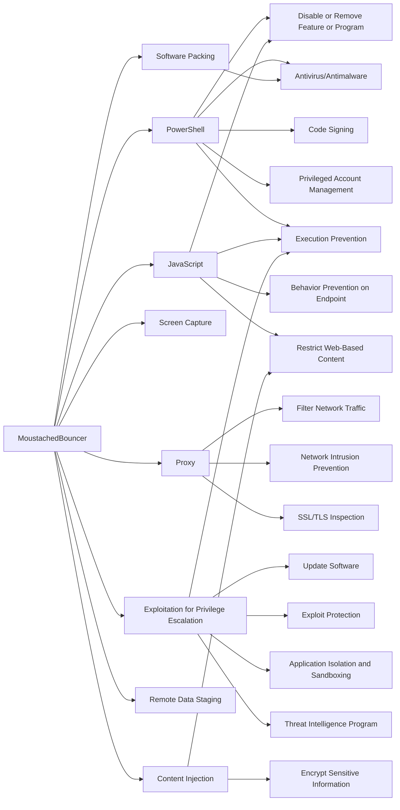

---
tags:
   - groups
---
# MoustachedBouncer
## ID:G1019
[MoustachedBouncer](groups/G1019) is a cyberespionage group that has been active since at least 2014 targeting foreign embassies in Belarus.(Citation: MoustachedBouncer ESET August 2023)
## Techniques Used By Group
* [PowerShell](techniques/T1059/001)
* [JavaScript](techniques/T1059/007)
* [Software Packing](techniques/T1027/002)
* [Screen Capture](techniques/T1113)
* [Proxy](techniques/T1090)
* [Exploitation for Privilege Escalation](techniques/T1068)
* [Remote Data Staging](techniques/T1074/002)
* [Content Injection](techniques/T1659)

# Summary of Techniques and Mitigations
