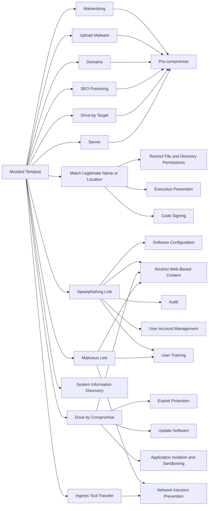

---
tags:
   - groups
---
# Mustard Tempest
## ID:G1020
[Mustard Tempest](groups/G1020) is an initial access broker that has operated the [SocGholish](software/S1124) distribution network since at least 2017. [Mustard Tempest](groups/G1020) has partnered with [Indrik Spider](groups/G0119) to provide access for the download of additional malware including LockBit, [WastedLocker](software/S0612), and remote access tools.(Citation: Microsoft Ransomware as a Service)(Citation: Microsoft Threat Actor Naming July 2023)(Citation: Secureworks Gold Prelude Profile)(Citation: SocGholish-update)
## Techniques Used By Group
* [Malvertising](techniques/T1583/008)
* [Upload Malware](techniques/T1608/001)
* [Match Legitimate Name or Location](techniques/T1036/005)
* [Spearphishing Link](techniques/T1566/002)
* [Domains](techniques/T1584/001)
* [SEO Poisoning](techniques/T1608/006)
* [Drive-by Target](techniques/T1608/004)
* [Drive-by Compromise](techniques/T1189)
* [Malicious Link](techniques/T1204/001)
* [System Information Discovery](techniques/T1082)
* [Server](techniques/T1583/004)
* [Ingress Tool Transfer](techniques/T1105)

# Summary of Techniques and Mitigations
