---
tags:
   - groups
---
# Cinnamon Tempest
## ID:G1021
[Cinnamon Tempest](groups/G1021) is a China-based threat group that has been active since at least 2021 deploying multiple strains of ransomware based on the leaked [Babuk](software/S0638) source code. [Cinnamon Tempest](groups/G1021) does not operate their ransomware on an affiliate model or purchase access but appears to act independently in all stages of the attack lifecycle. Based on victimology, the short lifespan of each ransomware variant, and use of malware attributed to government-sponsored threat groups, [Cinnamon Tempest](groups/G1021) may be motivated by intellectual property theft or cyberespionage rather than financial gain.(Citation: Microsoft Ransomware as a Service)(Citation: Microsoft Threat Actor Naming July 2023)(Citation: Trend Micro Cheerscrypt May 2022)(Citation: SecureWorks BRONZE STARLIGHT Ransomware Operations June 2022)
## Techniques Used By Group
* [Windows Management Instrumentation](techniques/T1047)
* [DLL Search Order Hijacking](techniques/T1574/001)
* [Ingress Tool Transfer](techniques/T1105)
* [Group Policy Modification](techniques/T1484/001)
* [Exfiltration to Cloud Storage](techniques/T1567/002)
* [Tool](techniques/T1588/002)
* [Valid Accounts](techniques/T1078)
* [Financial Theft](techniques/T1657)
* [Proxy](techniques/T1090)
* [Domain Accounts](techniques/T1078/002)
* [Exploit Public-Facing Application](techniques/T1190)
* [Python](techniques/T1059/006)
* [Deobfuscate/Decode Files or Information](techniques/T1140)
* [SMB/Windows Admin Shares](techniques/T1021/002)
* [Protocol Tunneling](techniques/T1572)
* [Taint Shared Content](techniques/T1080)
* [Windows Service](techniques/T1543/003)
* [DLL Side-Loading](techniques/T1574/002)
* [PowerShell](techniques/T1059/001)
* [Windows Command Shell](techniques/T1059/003)

# Summary of Techniques and Mitigations

```mermaid
flowchart LR
group[Cinnamon Tempest] --> T1047[Windows Management Instrumentation]
group[Cinnamon Tempest] --> T1574.001[DLL Search Order Hijacking]
group[Cinnamon Tempest] --> T1105[Ingress Tool Transfer]
group[Cinnamon Tempest] --> T1484.001[Group Policy Modification]
group[Cinnamon Tempest] --> T1567.002[Exfiltration to Cloud Storage]
group[Cinnamon Tempest] --> T1588.002[Tool]
group[Cinnamon Tempest] --> T1078[Valid Accounts]
group[Cinnamon Tempest] --> T1657[Financial Theft]
group[Cinnamon Tempest] --> T1090[Proxy]
group[Cinnamon Tempest] --> T1078.002[Domain Accounts]
group[Cinnamon Tempest] --> T1190[Exploit Public-Facing Application]
group[Cinnamon Tempest] --> T1059.006[Python]
group[Cinnamon Tempest] --> T1140[Deobfuscate/Decode Files or Information]
group[Cinnamon Tempest] --> T1021.002[SMB/Windows Admin Shares]
group[Cinnamon Tempest] --> T1572[Protocol Tunneling]
group[Cinnamon Tempest] --> T1080[Taint Shared Content]
group[Cinnamon Tempest] --> T1543.003[Windows Service]
group[Cinnamon Tempest] --> T1574.002[DLL Side-Loading]
group[Cinnamon Tempest] --> T1059.001[PowerShell]
group[Cinnamon Tempest] --> T1059.003[Windows Command Shell]
T1047[Windows Management Instrumentation] --> M1026[Privileged Account Management]
T1047[Windows Management Instrumentation] --> M1040[Behavior Prevention on Endpoint]
T1047[Windows Management Instrumentation] --> M1018[User Account Management]
T1047[Windows Management Instrumentation] --> M1038[Execution Prevention]
T1574.001[DLL Search Order Hijacking] --> M1038[Execution Prevention]
T1574.001[DLL Search Order Hijacking] --> M1044[Restrict Library Loading]
T1574.001[DLL Search Order Hijacking] --> M1047[Audit]
T1105[Ingress Tool Transfer] --> M1031[Network Intrusion Prevention]
T1484.001[Group Policy Modification] --> M1047[Audit]
T1484.001[Group Policy Modification] --> M1018[User Account Management]
T1567.002[Exfiltration to Cloud Storage] --> M1021[Restrict Web-Based Content]
T1588.002[Tool] --> M1056[Pre-compromise]
T1078[Valid Accounts] --> M1027[Password Policies]
T1078[Valid Accounts] --> M1018[User Account Management]
T1078[Valid Accounts] --> M1026[Privileged Account Management]
T1078[Valid Accounts] --> M1013[Application Developer Guidance]
T1078[Valid Accounts] --> M1017[User Training]
T1078[Valid Accounts] --> M1015[Active Directory Configuration]
T1078[Valid Accounts] --> M1036[Account Use Policies]
T1657[Financial Theft] --> M1017[User Training]
T1657[Financial Theft] --> M1018[User Account Management]
T1090[Proxy] --> M1037[Filter Network Traffic]
T1090[Proxy] --> M1031[Network Intrusion Prevention]
T1090[Proxy] --> M1020[SSL/TLS Inspection]
T1078.002[Domain Accounts] --> M1032[Multi-factor Authentication]
T1078.002[Domain Accounts] --> M1026[Privileged Account Management]
T1078.002[Domain Accounts] --> M1017[User Training]
T1190[Exploit Public-Facing Application] --> M1048[Application Isolation and Sandboxing]
T1190[Exploit Public-Facing Application] --> M1030[Network Segmentation]
T1190[Exploit Public-Facing Application] --> M1016[Vulnerability Scanning]
T1190[Exploit Public-Facing Application] --> M1026[Privileged Account Management]
T1190[Exploit Public-Facing Application] --> M1050[Exploit Protection]
T1190[Exploit Public-Facing Application] --> M1051[Update Software]
T1059.006[Python] --> M1047[Audit]
T1059.006[Python] --> M1049[Antivirus/Antimalware]
T1059.006[Python] --> M1033[Limit Software Installation]
T1059.006[Python] --> M1038[Execution Prevention]
T1021.002[SMB/Windows Admin Shares] --> M1026[Privileged Account Management]
T1021.002[SMB/Windows Admin Shares] --> M1035[Limit Access to Resource Over Network]
T1021.002[SMB/Windows Admin Shares] --> M1037[Filter Network Traffic]
T1021.002[SMB/Windows Admin Shares] --> M1027[Password Policies]
T1572[Protocol Tunneling] --> M1037[Filter Network Traffic]
T1572[Protocol Tunneling] --> M1031[Network Intrusion Prevention]
T1080[Taint Shared Content] --> M1049[Antivirus/Antimalware]
T1080[Taint Shared Content] --> M1038[Execution Prevention]
T1080[Taint Shared Content] --> M1022[Restrict File and Directory Permissions]
T1080[Taint Shared Content] --> M1050[Exploit Protection]
T1543.003[Windows Service] --> M1040[Behavior Prevention on Endpoint]
T1543.003[Windows Service] --> M1028[Operating System Configuration]
T1543.003[Windows Service] --> M1047[Audit]
T1543.003[Windows Service] --> M1045[Code Signing]
T1543.003[Windows Service] --> M1018[User Account Management]
T1574.002[DLL Side-Loading] --> M1051[Update Software]
T1574.002[DLL Side-Loading] --> M1013[Application Developer Guidance]
T1059.001[PowerShell] --> M1042[Disable or Remove Feature or Program]
T1059.001[PowerShell] --> M1049[Antivirus/Antimalware]
T1059.001[PowerShell] --> M1045[Code Signing]
T1059.001[PowerShell] --> M1026[Privileged Account Management]
T1059.001[PowerShell] --> M1038[Execution Prevention]
T1059.003[Windows Command Shell] --> M1038[Execution Prevention]
```
