---
tags:
   - groups
---
# ToddyCat
## ID:G1022
[ToddyCat](groups/G1022) is a sophisticated threat group that has been active since at least 2020 using custom loaders and malware in multi-stage infection chains against government and military targets across Europe and Asia.(Citation: Kaspersky ToddyCat June 2022)(Citation: Kaspersky ToddyCat Check Logs October 2023)
## Techniques Used By Group
* [Data from Local System](techniques/T1005)
* [Domain Groups](techniques/T1069/002)
* [Scheduled Task](techniques/T1053/005)
* [Spearphishing via Service](techniques/T1566/003)
* [Domain Account](techniques/T1087/002)
* [Non-Application Layer Protocol](techniques/T1095)
* [Domain Accounts](techniques/T1078/002)
* [Native API](techniques/T1106)
* [Process Discovery](techniques/T1057)
* [Remote System Discovery](techniques/T1018)
* [Disable or Modify System Firewall](techniques/T1562/004)
* [System Network Connections Discovery](techniques/T1049)
* [SMB/Windows Admin Shares](techniques/T1021/002)
* [Windows Command Shell](techniques/T1059/003)
* [Exploit Public-Facing Application](techniques/T1190)
* [Exfiltration to Cloud Storage](techniques/T1567/002)
* [Security Software Discovery](techniques/T1518/001)
* [PowerShell](techniques/T1059/001)
* [Hidden Window](techniques/T1564/003)
* [File and Directory Discovery](techniques/T1083)
* [Remote Data Staging](techniques/T1074/002)
* [Windows Management Instrumentation](techniques/T1047)
* [Match Legitimate Name or Location](techniques/T1036/005)
* [System Information Discovery](techniques/T1082)
* [Archive via Utility](techniques/T1560/001)

# Summary of Techniques and Mitigations

```mermaid
flowchart LR
group[ToddyCat] --> T1005[Data from Local System]
group[ToddyCat] --> T1069.002[Domain Groups]
group[ToddyCat] --> T1053.005[Scheduled Task]
group[ToddyCat] --> T1566.003[Spearphishing via Service]
group[ToddyCat] --> T1087.002[Domain Account]
group[ToddyCat] --> T1095[Non-Application Layer Protocol]
group[ToddyCat] --> T1078.002[Domain Accounts]
group[ToddyCat] --> T1106[Native API]
group[ToddyCat] --> T1057[Process Discovery]
group[ToddyCat] --> T1018[Remote System Discovery]
group[ToddyCat] --> T1562.004[Disable or Modify System Firewall]
group[ToddyCat] --> T1049[System Network Connections Discovery]
group[ToddyCat] --> T1021.002[SMB/Windows Admin Shares]
group[ToddyCat] --> T1059.003[Windows Command Shell]
group[ToddyCat] --> T1190[Exploit Public-Facing Application]
group[ToddyCat] --> T1567.002[Exfiltration to Cloud Storage]
group[ToddyCat] --> T1518.001[Security Software Discovery]
group[ToddyCat] --> T1059.001[PowerShell]
group[ToddyCat] --> T1564.003[Hidden Window]
group[ToddyCat] --> T1083[File and Directory Discovery]
group[ToddyCat] --> T1074.002[Remote Data Staging]
group[ToddyCat] --> T1047[Windows Management Instrumentation]
group[ToddyCat] --> T1036.005[Match Legitimate Name or Location]
group[ToddyCat] --> T1082[System Information Discovery]
group[ToddyCat] --> T1560.001[Archive via Utility]
T1005[Data from Local System] --> M1057[Data Loss Prevention]
T1053.005[Scheduled Task] --> M1026[Privileged Account Management]
T1053.005[Scheduled Task] --> M1018[User Account Management]
T1053.005[Scheduled Task] --> M1047[Audit]
T1053.005[Scheduled Task] --> M1028[Operating System Configuration]
T1566.003[Spearphishing via Service] --> M1017[User Training]
T1566.003[Spearphishing via Service] --> M1049[Antivirus/Antimalware]
T1566.003[Spearphishing via Service] --> M1021[Restrict Web-Based Content]
T1087.002[Domain Account] --> M1028[Operating System Configuration]
T1095[Non-Application Layer Protocol] --> M1031[Network Intrusion Prevention]
T1095[Non-Application Layer Protocol] --> M1037[Filter Network Traffic]
T1095[Non-Application Layer Protocol] --> M1030[Network Segmentation]
T1078.002[Domain Accounts] --> M1032[Multi-factor Authentication]
T1078.002[Domain Accounts] --> M1026[Privileged Account Management]
T1078.002[Domain Accounts] --> M1017[User Training]
T1106[Native API] --> M1038[Execution Prevention]
T1106[Native API] --> M1040[Behavior Prevention on Endpoint]
T1562.004[Disable or Modify System Firewall] --> M1047[Audit]
T1562.004[Disable or Modify System Firewall] --> M1018[User Account Management]
T1562.004[Disable or Modify System Firewall] --> M1024[Restrict Registry Permissions]
T1562.004[Disable or Modify System Firewall] --> M1022[Restrict File and Directory Permissions]
T1021.002[SMB/Windows Admin Shares] --> M1026[Privileged Account Management]
T1021.002[SMB/Windows Admin Shares] --> M1035[Limit Access to Resource Over Network]
T1021.002[SMB/Windows Admin Shares] --> M1037[Filter Network Traffic]
T1021.002[SMB/Windows Admin Shares] --> M1027[Password Policies]
T1059.003[Windows Command Shell] --> M1038[Execution Prevention]
T1190[Exploit Public-Facing Application] --> M1048[Application Isolation and Sandboxing]
T1190[Exploit Public-Facing Application] --> M1030[Network Segmentation]
T1190[Exploit Public-Facing Application] --> M1016[Vulnerability Scanning]
T1190[Exploit Public-Facing Application] --> M1026[Privileged Account Management]
T1190[Exploit Public-Facing Application] --> M1050[Exploit Protection]
T1190[Exploit Public-Facing Application] --> M1051[Update Software]
T1567.002[Exfiltration to Cloud Storage] --> M1021[Restrict Web-Based Content]
T1059.001[PowerShell] --> M1042[Disable or Remove Feature or Program]
T1059.001[PowerShell] --> M1049[Antivirus/Antimalware]
T1059.001[PowerShell] --> M1045[Code Signing]
T1059.001[PowerShell] --> M1026[Privileged Account Management]
T1059.001[PowerShell] --> M1038[Execution Prevention]
T1564.003[Hidden Window] --> M1038[Execution Prevention]
T1564.003[Hidden Window] --> M1033[Limit Software Installation]
T1047[Windows Management Instrumentation] --> M1026[Privileged Account Management]
T1047[Windows Management Instrumentation] --> M1040[Behavior Prevention on Endpoint]
T1047[Windows Management Instrumentation] --> M1018[User Account Management]
T1047[Windows Management Instrumentation] --> M1038[Execution Prevention]
T1036.005[Match Legitimate Name or Location] --> M1022[Restrict File and Directory Permissions]
T1036.005[Match Legitimate Name or Location] --> M1038[Execution Prevention]
T1036.005[Match Legitimate Name or Location] --> M1045[Code Signing]
T1560.001[Archive via Utility] --> M1047[Audit]
```
