---
tags:
   - groups
---
# APT5
## ID:G1023
[APT5](/mitre/groups/G1023) is a China-based espionage actor that has been active since at least 2007 primarily targeting the telecommunications, aerospace, and defense industries throughout the U.S., Europe, and Asia. [APT5](/mitre/groups/G1023) has displayed advanced tradecraft and significant interest in compromising networking devices and their underlying software including through the use of zero-day exploits.(Citation: NSA APT5 Citrix Threat Hunting December 2022)(Citation: Microsoft East Asia Threats September 2023)(Citation: Mandiant Pulse Secure Zero-Day April 2021)(Citation: Mandiant Pulse Secure Update May 2021)(Citation: FireEye Southeast Asia Threat Landscape March 2015)(Citation: Mandiant Advanced Persistent Threats)  
## Techniques Used By Group
* [PowerShell](techniques/T1059/001)
* [Local Account](techniques/T1136/001)
* [Timestomp](techniques/T1070/006)
* [Remote Desktop Protocol](techniques/T1021/001)
* [Log Enumeration](techniques/T1654)
* [Indicator Blocking](techniques/T1562/006)
* [Local Data Staging](techniques/T1074/001)
* [Compromise Host Software Binary](techniques/T1554)
* [Keylogging](techniques/T1056/001)
* [Cloud Accounts](techniques/T1078/004)
* [Archive via Utility](techniques/T1560/001)
* [LSASS Memory](techniques/T1003/001)
* [Security Account Manager](techniques/T1003/002)
* [File Deletion](techniques/T1070/004)
* [Account Manipulation](techniques/T1098)
* [Process Discovery](techniques/T1057)
* [Indicator Removal](techniques/T1070)
* [Cron](techniques/T1053/003)
* [Windows Command Shell](techniques/T1059/003)
* [SSH](techniques/T1021/004)
* [Process Injection](techniques/T1055)
* [Web Shell](techniques/T1505/003)
* [System Network Connections Discovery](techniques/T1049)
* [Domain Accounts](techniques/T1078/002)
* [Match Legitimate Name or Location](techniques/T1036/005)
* [Clear Command History](techniques/T1070/003)
* [File and Directory Discovery](techniques/T1083)
* [Exploit Public-Facing Application](techniques/T1190)

# Summary of Techniques and Mitigations

```mermaid
flowchart LR
group[APT5] --> T1059.001[PowerShell]
group[APT5] --> T1136.001[Local Account]
group[APT5] --> T1070.006[Timestomp]
group[APT5] --> T1021.001[Remote Desktop Protocol]
group[APT5] --> T1654[Log Enumeration]
group[APT5] --> T1562.006[Indicator Blocking]
group[APT5] --> T1074.001[Local Data Staging]
group[APT5] --> T1554[Compromise Host Software Binary]
group[APT5] --> T1056.001[Keylogging]
group[APT5] --> T1078.004[Cloud Accounts]
group[APT5] --> T1560.001[Archive via Utility]
group[APT5] --> T1003.001[LSASS Memory]
group[APT5] --> T1003.002[Security Account Manager]
group[APT5] --> T1070.004[File Deletion]
group[APT5] --> T1098[Account Manipulation]
group[APT5] --> T1057[Process Discovery]
group[APT5] --> T1070[Indicator Removal]
group[APT5] --> T1053.003[Cron]
group[APT5] --> T1059.003[Windows Command Shell]
group[APT5] --> T1021.004[SSH]
group[APT5] --> T1055[Process Injection]
group[APT5] --> T1505.003[Web Shell]
group[APT5] --> T1049[System Network Connections Discovery]
group[APT5] --> T1078.002[Domain Accounts]
group[APT5] --> T1036.005[Match Legitimate Name or Location]
group[APT5] --> T1070.003[Clear Command History]
group[APT5] --> T1083[File and Directory Discovery]
group[APT5] --> T1190[Exploit Public-Facing Application]
T1059.001[PowerShell] --> M1042[Disable or Remove Feature or Program]
T1059.001[PowerShell] --> M1049[Antivirus/Antimalware]
T1059.001[PowerShell] --> M1045[Code Signing]
T1059.001[PowerShell] --> M1026[Privileged Account Management]
T1059.001[PowerShell] --> M1038[Execution Prevention]
T1136.001[Local Account] --> M1032[Multi-factor Authentication]
T1136.001[Local Account] --> M1026[Privileged Account Management]
T1021.001[Remote Desktop Protocol] --> M1047[Audit]
T1021.001[Remote Desktop Protocol] --> M1035[Limit Access to Resource Over Network]
T1021.001[Remote Desktop Protocol] --> M1030[Network Segmentation]
T1021.001[Remote Desktop Protocol] --> M1028[Operating System Configuration]
T1021.001[Remote Desktop Protocol] --> M1042[Disable or Remove Feature or Program]
T1021.001[Remote Desktop Protocol] --> M1018[User Account Management]
T1021.001[Remote Desktop Protocol] --> M1032[Multi-factor Authentication]
T1021.001[Remote Desktop Protocol] --> M1026[Privileged Account Management]
T1654[Log Enumeration] --> M1018[User Account Management]
T1562.006[Indicator Blocking] --> M1022[Restrict File and Directory Permissions]
T1562.006[Indicator Blocking] --> M1054[Software Configuration]
T1562.006[Indicator Blocking] --> M1018[User Account Management]
T1554[Compromise Host Software Binary] --> M1045[Code Signing]
T1078.004[Cloud Accounts] --> M1027[Password Policies]
T1078.004[Cloud Accounts] --> M1015[Active Directory Configuration]
T1078.004[Cloud Accounts] --> M1026[Privileged Account Management]
T1078.004[Cloud Accounts] --> M1032[Multi-factor Authentication]
T1078.004[Cloud Accounts] --> M1036[Account Use Policies]
T1078.004[Cloud Accounts] --> M1017[User Training]
T1078.004[Cloud Accounts] --> M1018[User Account Management]
T1560.001[Archive via Utility] --> M1047[Audit]
T1003.001[LSASS Memory] --> M1028[Operating System Configuration]
T1003.001[LSASS Memory] --> M1043[Credential Access Protection]
T1003.001[LSASS Memory] --> M1025[Privileged Process Integrity]
T1003.001[LSASS Memory] --> M1026[Privileged Account Management]
T1003.001[LSASS Memory] --> M1017[User Training]
T1003.001[LSASS Memory] --> M1040[Behavior Prevention on Endpoint]
T1003.001[LSASS Memory] --> M1027[Password Policies]
T1003.002[Security Account Manager] --> M1027[Password Policies]
T1003.002[Security Account Manager] --> M1026[Privileged Account Management]
T1003.002[Security Account Manager] --> M1028[Operating System Configuration]
T1003.002[Security Account Manager] --> M1017[User Training]
T1098[Account Manipulation] --> M1030[Network Segmentation]
T1098[Account Manipulation] --> M1018[User Account Management]
T1098[Account Manipulation] --> M1032[Multi-factor Authentication]
T1098[Account Manipulation] --> M1026[Privileged Account Management]
T1098[Account Manipulation] --> M1028[Operating System Configuration]
T1070[Indicator Removal] --> M1041[Encrypt Sensitive Information]
T1070[Indicator Removal] --> M1029[Remote Data Storage]
T1070[Indicator Removal] --> M1022[Restrict File and Directory Permissions]
T1053.003[Cron] --> M1047[Audit]
T1053.003[Cron] --> M1018[User Account Management]
T1059.003[Windows Command Shell] --> M1038[Execution Prevention]
T1021.004[SSH] --> M1042[Disable or Remove Feature or Program]
T1021.004[SSH] --> M1032[Multi-factor Authentication]
T1021.004[SSH] --> M1018[User Account Management]
T1055[Process Injection] --> M1026[Privileged Account Management]
T1055[Process Injection] --> M1040[Behavior Prevention on Endpoint]
T1505.003[Web Shell] --> M1042[Disable or Remove Feature or Program]
T1505.003[Web Shell] --> M1018[User Account Management]
T1078.002[Domain Accounts] --> M1032[Multi-factor Authentication]
T1078.002[Domain Accounts] --> M1026[Privileged Account Management]
T1078.002[Domain Accounts] --> M1017[User Training]
T1036.005[Match Legitimate Name or Location] --> M1022[Restrict File and Directory Permissions]
T1036.005[Match Legitimate Name or Location] --> M1038[Execution Prevention]
T1036.005[Match Legitimate Name or Location] --> M1045[Code Signing]
T1070.003[Clear Command History] --> M1029[Remote Data Storage]
T1070.003[Clear Command History] --> M1022[Restrict File and Directory Permissions]
T1070.003[Clear Command History] --> M1039[Environment Variable Permissions]
T1190[Exploit Public-Facing Application] --> M1048[Application Isolation and Sandboxing]
T1190[Exploit Public-Facing Application] --> M1030[Network Segmentation]
T1190[Exploit Public-Facing Application] --> M1016[Vulnerability Scanning]
T1190[Exploit Public-Facing Application] --> M1026[Privileged Account Management]
T1190[Exploit Public-Facing Application] --> M1050[Exploit Protection]
T1190[Exploit Public-Facing Application] --> M1051[Update Software]
```
