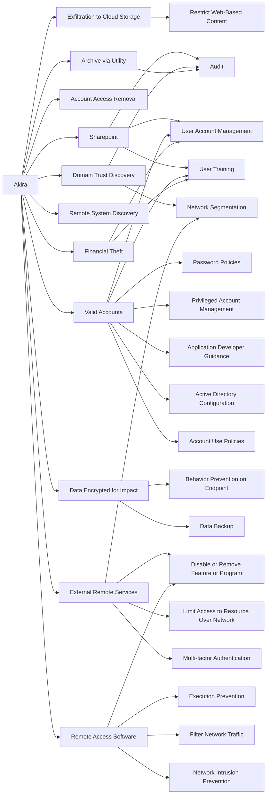

---
tags:
   - groups
---
# Akira
## ID:G1024
[Akira](/mitre/groups/G1024) is a ransomware variant and ransomware deployment entity active since at least March 2023.(Citation: Arctic Wolf Akira 2023) [Akira](/mitre/groups/G1024) uses compromised credentials to access single-factor external access mechanisms such as VPNs for initial access, then various publicly-available tools and techniques for lateral movement.(Citation: Arctic Wolf Akira 2023)(Citation: Secureworks GOLD SAHARA) [Akira](/mitre/groups/G1024) operations are associated with "double extortion" ransomware activity, where data is exfiltrated from victim environments prior to encryption, with threats to publish files if a ransom is not paid. Technical analysis of [Akira](/mitre/software/S1129) ransomware indicates multiple overlaps with and similarities to [Conti](/mitre/software/S0575) malware.(Citation: BushidoToken Akira 2023)
## Techniques Used By Group
* [Exfiltration to Cloud Storage](techniques/T1567/002)
* [Sharepoint](techniques/T1213/002)
* [Account Access Removal](techniques/T1531)
* [Domain Trust Discovery](techniques/T1482)
* [Valid Accounts](techniques/T1078)
* [Remote System Discovery](techniques/T1018)
* [Financial Theft](techniques/T1657)
* [Data Encrypted for Impact](techniques/T1486)
* [External Remote Services](techniques/T1133)
* [Remote Access Software](techniques/T1219)
* [Archive via Utility](techniques/T1560/001)

# Summary of Techniques and Mitigations
