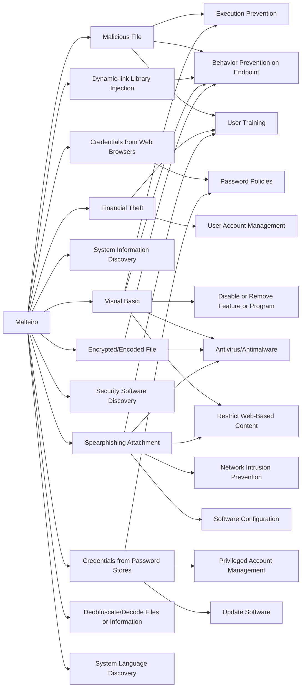

---
tags:
   - groups
---
# Malteiro
## ID:G1026
[Malteiro](groups/G1026) is a financially motivated criminal group that is likely based in Brazil and has been active since at least November 2019. The group operates and distributes the [Mispadu](software/S1122)  banking trojan via a Malware-as-a-Service (MaaS) business model. [Malteiro](groups/G1026) mainly targets victims throughout Latin America (particularly Mexico) and Europe (particularly Spain and Portugal).(Citation: SCILabs Malteiro 2021)
## Techniques Used By Group
* [Malicious File](techniques/T1204/002)
* [Credentials from Web Browsers](techniques/T1555/003)
* [Dynamic-link Library Injection](techniques/T1055/001)
* [Financial Theft](techniques/T1657)
* [System Information Discovery](techniques/T1082)
* [Visual Basic](techniques/T1059/005)
* [Encrypted/Encoded File](techniques/T1027/013)
* [Security Software Discovery](techniques/T1518/001)
* [Spearphishing Attachment](techniques/T1566/001)
* [Credentials from Password Stores](techniques/T1555)
* [Deobfuscate/Decode Files or Information](techniques/T1140)
* [System Language Discovery](techniques/T1614/001)

# Summary of Techniques and Mitigations
